# 🐙 Octo-Slider

A browser-based PPTX slide editor — no installs, no sign-ups, runs entirely in your browser.  
Create professional presentations with themed templates, export to PowerPoint, and present directly.

**[Try it live →](https://softchris.github.io/octo-slider/)**

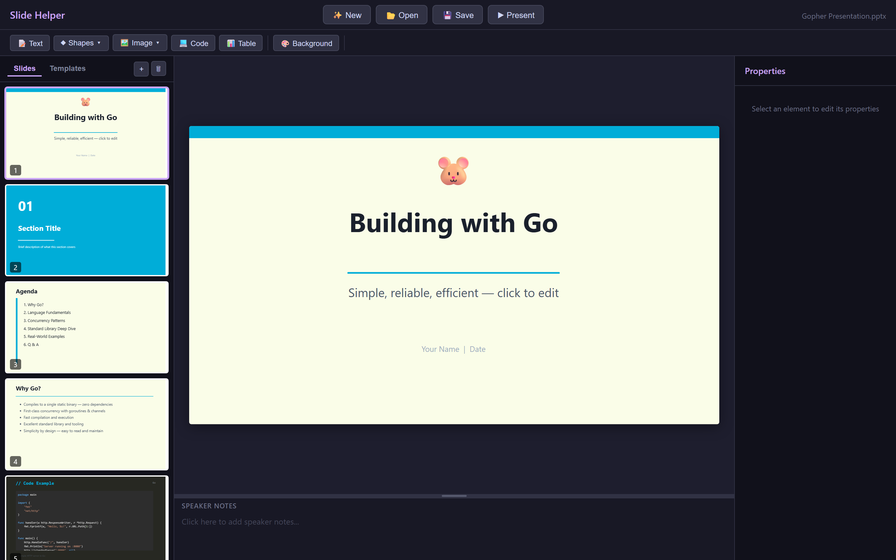

---

## ✨ Features

### 🎨 9 Built-in Themes (108 Templates)

Start a new presentation from scratch or pick a complete theme. Each theme includes 12 slide types: Title, Section, Agenda, Bullets, Code, Compare & Contrast, Quote, Image + Text, Thank You, Table, 2-Column, and 3-Column layouts.

| Theme | Style | Target Audience |
|-------|-------|----------------|
| **Midnight** | Dark navy & crimson | General |
| **Aurora** | Gradient purple & warm tones | General |
| **Clean** | Light white & blue | General / Corporate |
| **Gopher** 🐹 | Cyan & teal on light yellow | Go developers |
| **Rustacean** 🦀 | Orange & dark navy | Rust developers |
| **JavaScript** | Yellow & dark editor style | JS/TS developers |
| **.NET** | Purple & blue | C# / .NET developers |
| **Java** ☕ | Blue & orange on light gray | Java developers |
| **Python** 🐍 | Blue & yellow on Tokyo Night dark | Python / Data / ML developers |

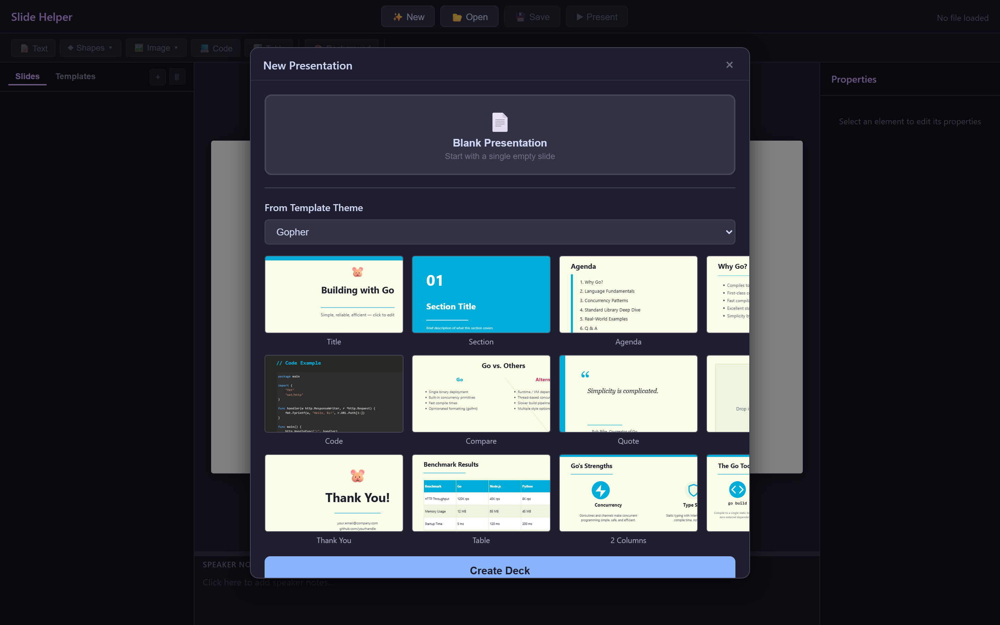

### 📝 Rich Element Types

Add and edit a variety of elements on your slides:

- **Text boxes** — Rich formatting: font, size, bold, italic, underline, color, alignment, line spacing, bullet & numbered lists
- **Shapes** — 15 shape types including rectangles, ellipses, arrows, stars, callouts, and more
- **Images** — Drag & drop or file picker, with full resize/position control
- **Icons** — Vector-based SVG icons from a built-in library
- **Code blocks** — Syntax-highlighted code with language selection (Go, Rust, Java, C#, JavaScript, Python, and more)
- **Tables** — Configurable rows/columns, header styling, alternating row colors, editable cells
- **Lines** — Connectors with adjustable endpoints and styling

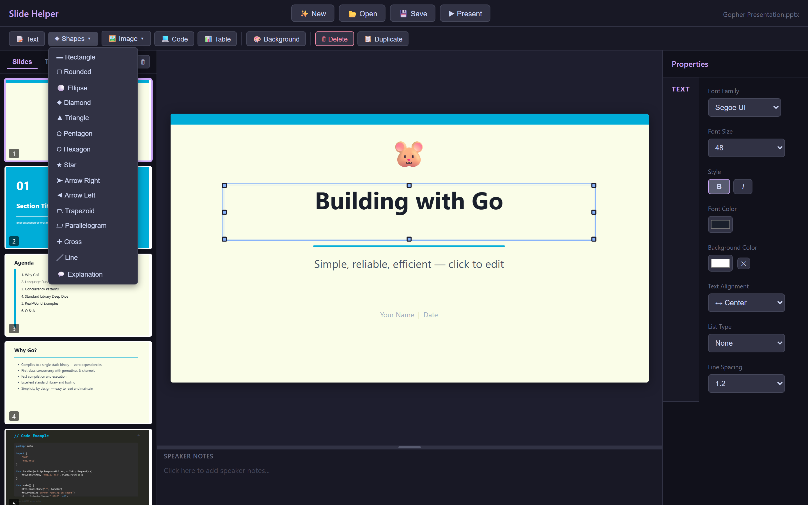

### 💻 Code Slides with Syntax Highlighting

Each developer theme includes a Code slide with real, idiomatic code examples. The syntax highlighter supports keywords, strings, comments, and more.

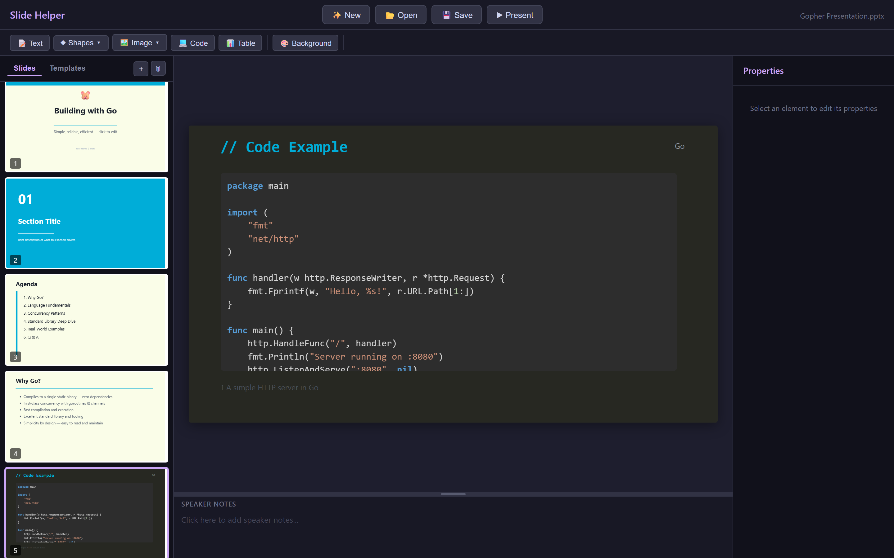

### 📊 Tables

Insert tables with a visual row/column picker. Edit cells by double-clicking, navigate with Tab/Shift+Tab, and auto-add rows by tabbing past the last cell. Customize header colors, alternating row backgrounds, borders, and font size from the properties panel.

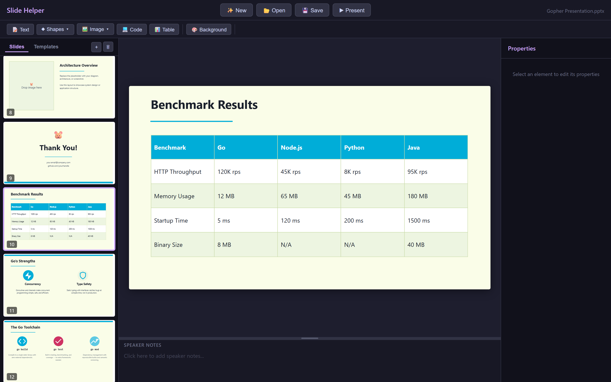

### 🖱️ Direct Manipulation

- **Click** to select elements
- **Drag** to move them
- **Resize handles** on corners and edges
- **Double-click** to edit text inline
- **Multi-select** with Ctrl+Click
- **Arrow keys** navigate between slides in the thumbnail panel

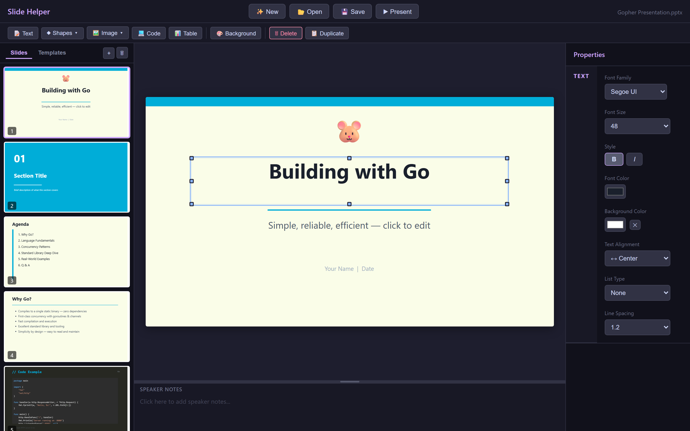

### 🎭 Properties Panel

Select any element to see its editable properties on the right panel:

- **Text**: Font, size, color, bold/italic/underline, alignment, line spacing, list type
- **Shapes**: Fill color, border color & width, shadow type & color
- **Images**: Shadow, border, opacity
- **Tables**: Header colors, row/column count, alternating row colors, font size
- **Code**: Language, font size, background color

### 🔄 Undo (Ctrl+Z)

Full undo support with a 50-step snapshot stack. Continuous operations like dragging and resizing are batched into a single undo entry.

### 🗒️ Speaker Notes

Each slide has a speaker notes area below the editor. Drag the resize handle to show more or less of the notes panel. Notes are preserved when exporting to PPTX.

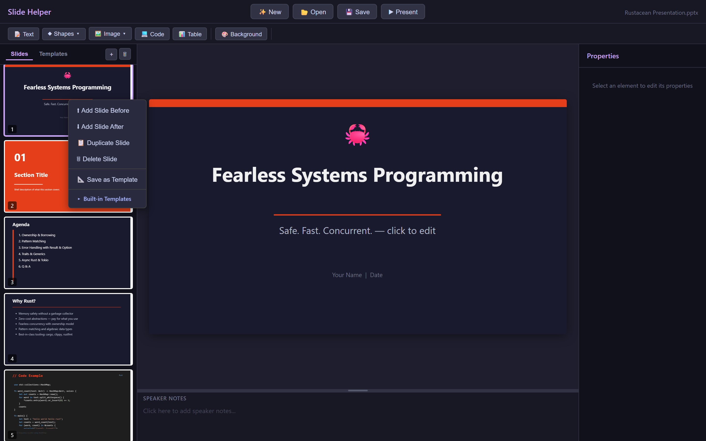

### ▶️ Presenter Mode

Click **Present** to enter full-screen presentation mode:
- **From Beginning** — starts at slide 1
- **From Current Slide** — starts at the selected slide
- Use arrow keys or click to navigate
- Press **Escape** to exit

### 📂 PPTX Import & Export

- **Open** any `.pptx` file — parses text, images, shapes, and basic formatting
- **Save** your work as a standard `.pptx` file compatible with PowerPoint, Google Slides, and Keynote

### 📋 Context Menu

Right-click on a slide thumbnail for quick actions:

- Add slide before / after
- Duplicate slide
- Delete slide
- Apply a built-in template from any theme
- Save current slide as a custom template


### 🆕 New Presentation Dialog

The **✨ New** button opens a dialog where you can:

1. **Blank Presentation** — start with a single empty slide
2. **From Template Theme** — pick a theme, preview all 12 slides, then create a complete deck with one click

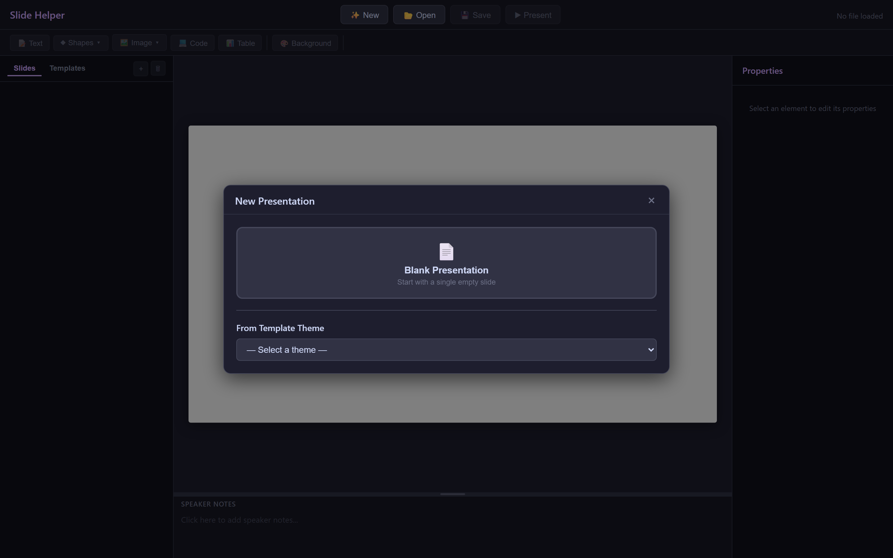

---

## 🚀 Getting Started

### Live Version

Just visit **[softchris.github.io/octo-slider](https://softchris.github.io/octo-slider/)** — no installation needed.

### Run Locally

```bash
# Clone the repository
git clone https://github.com/softchris/octo-slider.git
cd octo-slider

# Serve with any static HTTP server
python -m http.server 8002
# or
npx serve -p 8002
```

Open **http://localhost:8002** in your browser.

> **Note:** Octo-Slider is a pure static site (HTML/CSS/JS). No build step, no bundler, no Node.js required to run — any HTTP server will do.

---

## 🎹 Keyboard Shortcuts

| Shortcut | Action |
|----------|--------|
| `Ctrl+Z` | Undo |
| `Delete` | Delete selected element(s) |
| `↑ ↓` | Navigate slides (when thumbnail is focused) |
| `Tab` | Next table cell |
| `Shift+Tab` | Previous table cell |
| `Escape` | Exit text editing / presenter mode |
| `Double-click` | Edit text or table cell |

---

## 🏗️ Architecture

Octo-Slider is built with vanilla JavaScript — no frameworks, no build tools.

```
index.html              ← Entry point & UI structure
css/styles.css          ← All styling
js/
  app.js                ← Main wiring, event handlers
  slide-model.js        ← Data model, undo stack, master layouts
  slide-renderer.js     ← DOM rendering for slides & thumbnails
  editor.js             ← Selection, drag, resize, text/table editing
  toolbar.js            ← Toolbar controls & property panel
  built-in-layouts.js   ← 108 template definitions across 9 themes
  pptx-parser.js        ← PPTX import (reads .pptx files)
  pptx-writer.js        ← PPTX export (generates .pptx files)
  syntax-highlight.js   ← Code block syntax highlighting
  icon-library.js       ← SVG icon definitions
```

---

## 📸 Theme Gallery

### Gopher (Go)


### .NET / C#
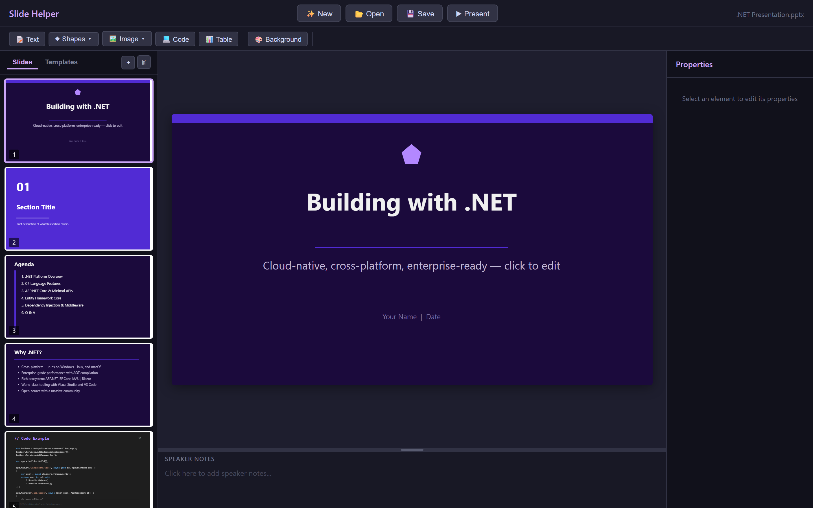

### JavaScript
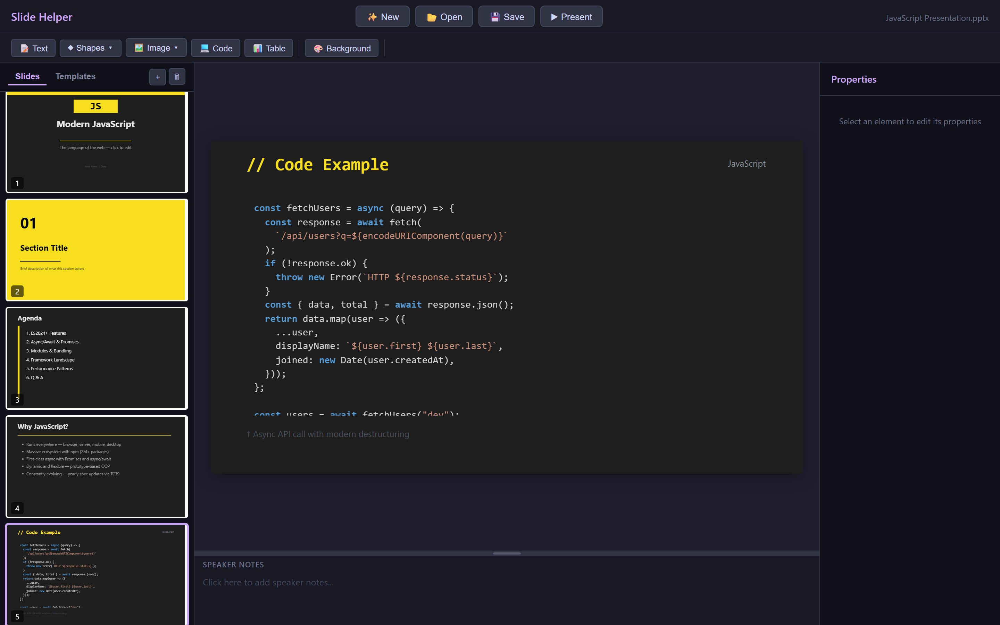

### Rustacean (Rust)
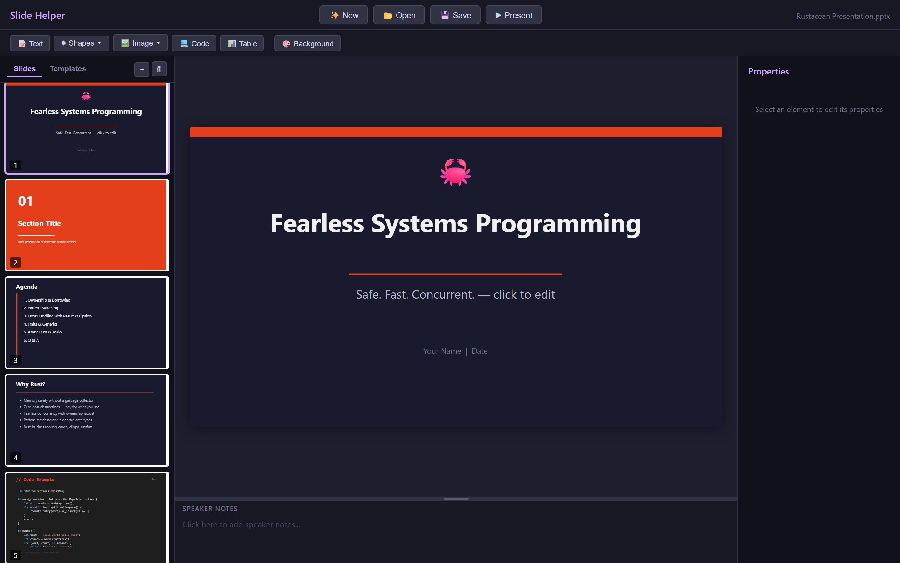

### Java
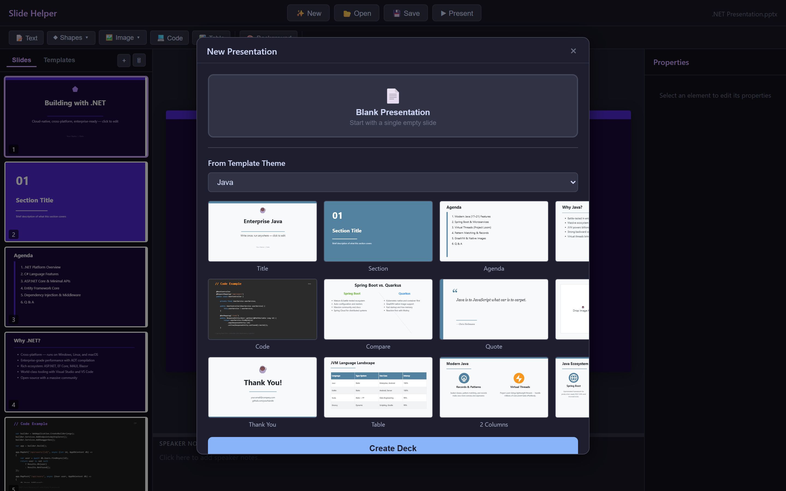

### Python
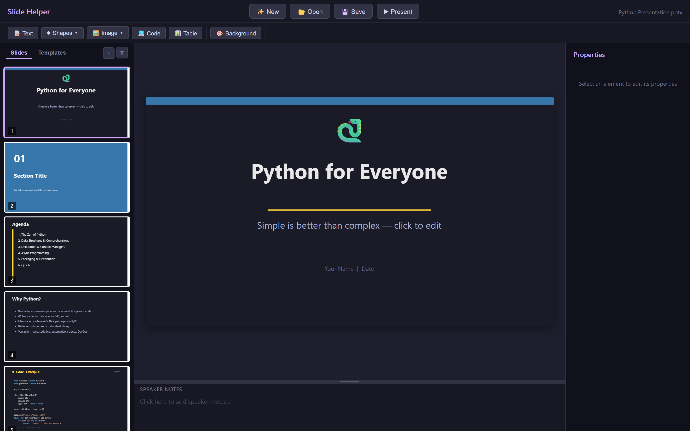
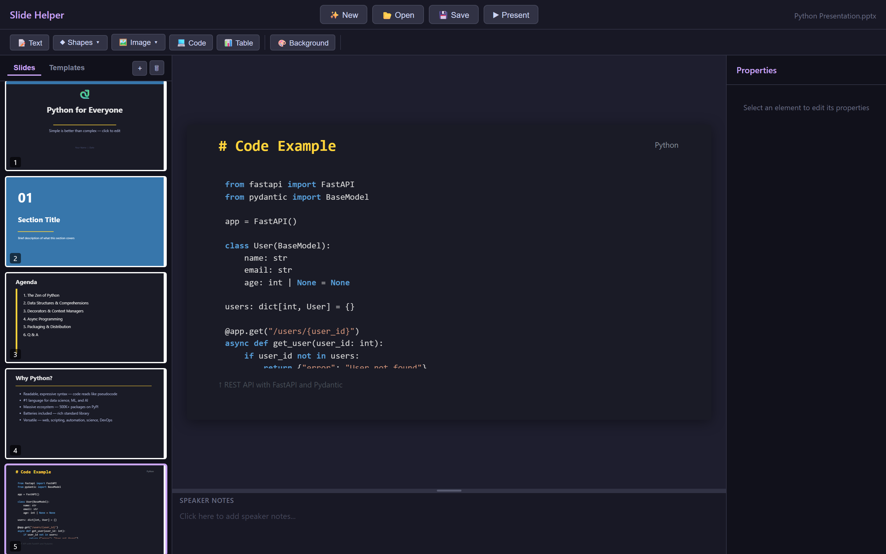

---

## 📄 License

MIT

---

Built with ❤️ and vanilla JavaScript.
